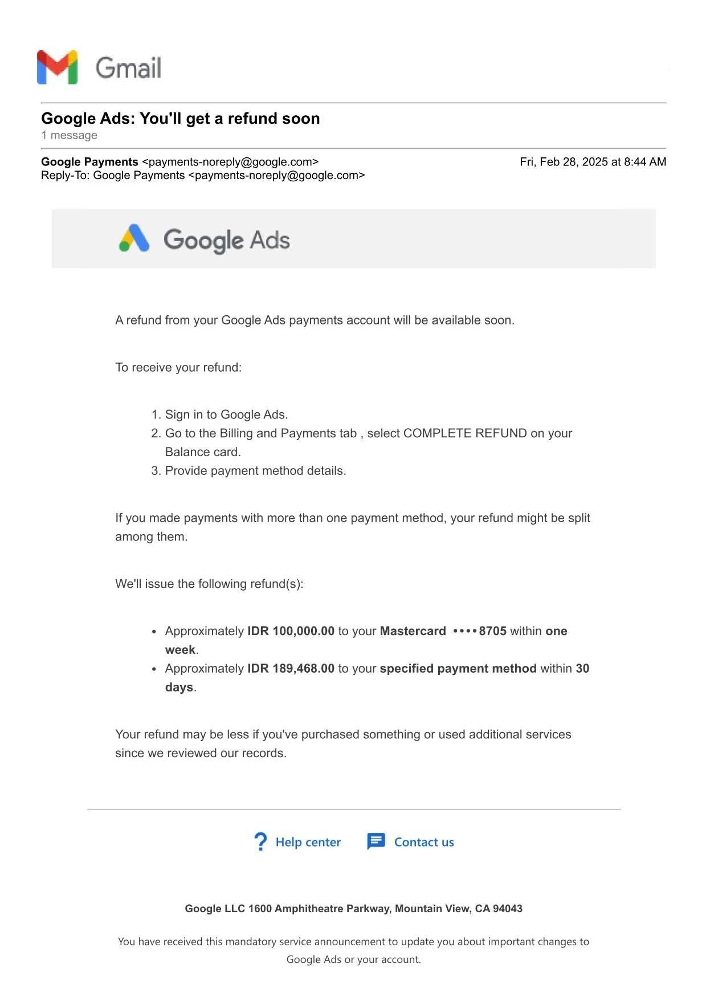

# **Case:**

Automatic refund process from Google Ads payment profile to bank account triggered by closing the payment profile failed due to the missing option to select “COMPLETE REFUND”, which was mentioned in the first notification e-mail about the refund. This document shows an attempt to get help from the support team.

## **Start date of process:** 

* 2025.02.28.

## **Date of latest update to this document:** 

* 2025.05.23.

## **Duration of process so far (based on Date of latest update to this document):**

* 84 days

## **Structure of document:**

* EVENTS are sorted by ascending order of date (i.e. latest update at the end of document). SCREENSHOTS of events where a reply is sent to an e-mail are sorted by a descending order of date (i.e. latest reply to an e-mail is at the beginning of the screenshot). E-mail MESSAGES are followed by the attachments sent with the e-mail (if there’s any).

## **Number of e-mails sent and received in connection with this case:**

* 31

## **Current status:**

* Unsolved, the support team keeps preventing the completion of a legitimate refund process with various dark tactics and strategies.

## **Previous statuses:**

* Unsolved, the support team keeps preventing the completion of a legitimate refund process with various dark tactics and strategies.

# Events #

## **Event number:** 01\.

**Event date:** 2025.02.28.

**Event:** Automatic notification about available unused funds eligible for refund from a Google Ads payment profile.

**Issue:** Option mentioned in the notification mail to “COMPLETE REFUND” was not found on the “Billing and Payments tab”, nor on the “Balance card”.

**Step taken by customer:** Trying to reach Google Ads Support for help. 

## **Event number:** 02\.

![][image2]

**Event date:** 2025.02.28.

**Event:** Trying to finish the refund process by reaching out to the support team, since the instructions provided in the notification email do not match with website UI.

**Issue:** Contacting support through Google Ads Help Center is impossible, or the option is so hidden on purpose that it is nearly impossible.

**Step taken by customer:** Sending e-mails to the address where notification was coming from and some other published e-mail addresses, hoping that one will reach the intended recipient.  

## **Event number:** 03\.

![][image3]

**Event date:** 2025.03.14. (14 days after sending the support request).

**Event:** A case is created.

**Issue:** None.

**Step taken by customer:** Waiting patiently.  

## **Event number:** 04\.

![][image4]

**Event date:** 2025.03.17. (17 days after sending a support request, 3 days after creating the case).

**Event:** Notification informing customer that the support team is starting to deal with the case.

**Issue:** None.

**Step taken by customer:** Waiting patiently.

## **Event number:** 05\.

![][image5]

**Event date:** 2025.03.19. (19 days after sending a support request, 5 days after creating the case).

**Event:** Notification again about available funds for refund, this time by the support team. The support team offers an option to refund by bank transfer.

**Issue:** The support team ignored a previous request to transfer funds to the new Google Ads Payment profile, instead of sending the refund to our bank account.

**Step taken by customer:** Spending time formulating a reply.

## **Event number:** 06\.

![][image6]
![][image7]

**Event date:** 2025.03.20. (20 days after sending a support request, 6 days after creating the case).

**Event:** Replying to the previous notification.

**Issue:** The support team ignored a previous request to transfer funds to the new Google Ads Payment profile, instead of sending the refund to our bank account.

**Step taken by customer:** Asking the same question again, sending the same attachment again.

## **Event number:** 07\.

![][image8]

**Event date:** 2025.03.20. (20 days after sending a support request, 6 days after creating the case).

**Event:** The support team informing the customer that transferring to the new Google Ads payment profile is not possible. To make sure everything is in order the refund form must be submitted within 30 days from account deactivation date.

**Issue:** None.

**Step taken by customer:** Accepting that only a bank transfer is possible and submitting the data for the bank transfer on the form provided by the support team.

## **Event number:** 08\.

![][image9]

**Event date:** 2025.03.21. (21 days after sending a support request, 7 days after creating the case).

**Event:** Customer thanks the support team for their help and confirms the successful submission of the refund form.

**Issue:** None.

**Step taken by customer:** Following the instructions and acknowledging the situation, thanking the support team for their help and providing confirmation about the successful submission of the refund form. Waiting patiently, trusting that everything is in order with the case.

## **Event number:** 09\.

![][image10]
![][image11]
![][image12]
![][image13]
![][image14]
![][image15]

**Event date:** 2025.04.23. (54 days after sending a support request, 40 days after creating the case).

**Event:** Inquiry about the status of the refund, which has not arrived so far.

**Issue:** Despite promises by Google Ads and the support team, the customer has not received any notifications about starting the refund, nor did the customer receive the promised refund to the bank account provided on the refund form.

**Step taken by customer:** Collecting and organizing all information to provide a good overview of the problem to the support team, and sending inquiry about the status of the unfinished refund process.

## **Event number:** 10\.

![][image16]

**Event date:** 2025.04.24. (55 days after sending a support request, 41 days after creating the case).

**Event:** The support team requests verification by the customer to proceed with the case.

**Issue:** None.

**Step taken by customer:** Following instructions provided by the support team.

## **Event number:** 11\.

![][image17]  
![][image18]
![][image19]

**Event date:** 2025.04.24. (55 days after sending a support request, 41 days after creating the case).

**Event:** Verification requested by support, verification quickly completed by customer.

**Issue:** None.

**Step taken by customer:** Complying with the instructions, waiting patiently for any progress with the case.

## **Event number:** 12\.

![][image20]

**Event date:** 2025.04.25. (56 days after sending a support request, 42 days after creating the case).

**Event:** Notification from the support team that they are “unable to process the refund”.

**Issue:** No explanation why the refund process failed, only providing a completely uninformative explanation that does not make sense in light of the previous events, and considering what triggered the automatic refund process (i.e. closing the payment profile).

**Step taken by customer:** Formulating a response pointing out problems with the work of the wider / dedicated teams, requesting correction of the error.

## **Event number:** 13\.

![][image21]
![][image22]

**Event date:** 2025.04.25. (56 days after sending a support request, 42 days after creating the case).

**Event:** Notification from the support team that they are “unable to process the refund”.

**Issue:** No solutions or even an attempt to a solution was provided by the “support” team, acting as if the case was successfully solved and the customer’s request has been addressed properly.

**Step taken by customer:** Formulating another reply to clarify the problems from the customer’s perspective.

## **Event number:** 14\.

![][image23]
![][image24]

**Event date:** 2025.04.25. (56 days after sending a support request, 42 days after creating the case).

**Event:** Unsolved case neglected by the support team.

**Issue:** Unsolved case neglected by the support team.

**Step taken by customer:** Formulating another reply to request a quick solution to an already overly delayed process.

## **Event number:** 15\.

![][image25]

**Event date:** 2025.04.28. (59 days after sending a support request, 45 days after creating the case).

**Event:** The support team replies that they are working on “workarounds” for a credit to the current Google Ads payment profile, even if previously they stated that such a transfer is not possible (first ignoring this question / request, then claiming the impossibility of such a transfer between Google Ads payment profiles. See Events: 02\. 06, & 07.).

**Issue:** The support team provides self-contradicting pieces of information, shows repeated failures to keep their own promises and respect the requests of a paying customer. Note the formulation of a tricky opt-out by default option provided by the support team (i.e. if the customer does not actively reply (opt-in) to the last notification, the default setting is to opt-out from the continuation of the refund process. This way there is a higher chance that the support team will not have to process the refund if a customer forgets or misses to opt-in to continue the process)\!

**Step taken by customer:** Formulating a reply in a similar manner to the ones provided by the support team to minimize the waste of the customer’s valuable time at this point (i.e. copy-paste previous reply)..

## **Event number:** 16\.

![][image26]
![][image27]

**Event date:** 2025.04.28. (59 days after sending a support request, 45 days after creating the case).

**Event:** Request from support to opt-in actively if the customer wants to continue with the refund process started 59 days ago.

**Issue:** Failure to delegate the task to an appropriate team member, who is able to complete the promised refund ASAP.

**Step taken by customer:** Waiting patiently after clarifying the request and the case for the 16th time so far.  

## **Event number:** 17\.

![][image28]

**Event date:** 2025.04.29. (60 days after sending a support request, 46 days after creating the case).

**Event:** Update about nothing.

**Issue:** Further delay introduced by the support team, another failure to delegate the task to an appropriate team member, who is able to complete the promised refund ASAP.

**Step taken by customer:** Keeping the conversation going, and formulating response while waiting patiently.  

## **Event number:** 18\.

![][image29]

**Event date:** 2025.04.29. (60 days after sending a support request, 46 days after creating the case).

**Event:** Update about nothing.

**Issue:** Further delay introduced by the support team, another failure to delegate the task to an appropriate team member, who is able to complete the promised refund ASAP.

**Step taken by customer:** Expressing continued hope for the successful completion of the promised refund by a simple bank transfer.  

## **Event number:** 19\.

![][image30]

**Event date:** 2025.05.01. (62 days after sending a support request, 48 days after creating the case).

**Event:** Update about nothing. The support team starts to speculate about some important aspects.

**Issue:** Further delay introduced by the support team, another failure to delegate the task to an appropriate team member, who is able to complete the promised refund ASAP.

**Step taken by customer:** Waiting patiently.  
 
## **Event number:** 20\.

![][image31]

**Event date:** 2025.05.07. (68 days after sending a support request, 54 days after creating the case).

**Event:** Update about nothing. The support team is actively working on the case.

**Issue:** Further delay introduced by the support team, another failure to delegate the task to an appropriate team member, who is able to complete the promised refund ASAP.

**Step taken by customer:** Waiting patiently.  

## **Event number:** 21\.

![][image32]

**Event date:** 2025.05.12. (73 days after sending a support request, 59 days after creating the case).

**Event:** The refund request (as also mentioned in the subject of email) got magically reframed to a ”credit request” which was already claimed to be impossible by the same support team member (see Event 07.). A perfectly valid refund request (rightful, and in alignment with Google Ads’ own refund policy: [https://support.google.com/google-ads/answer/1703646](https://support.google.com/google-ads/answer/1703646) ) got magically reframed to a “courtesy credit”. Also note the default option which leads to non-fulfillment of the request in case of inaction from the customer.

**Issue:** Failure to delegate the task to an appropriate team member, who is able to complete the promised refund ASAP, deceptive, self-contradictory communication, disregarding both the request of the customer to transfer the funds to the bank account and disregarding Google Ads’ own refund policy.

**Step taken by customer:** Explaining the request and the unfairness of this procedure one more time to the support team.  
 
## **Event number:** 22\.

![][image33]
![][image34]

**Event date:** 2025.05.13. (74 days after sending a support request, 60 days after creating the case).

**Event:** Same as the previous Event.

**Issue:** Same as the previous Event.

**Step taken by customer:** Reply sent with detailed explanations and plans for escalation.  
 
## **Event number:** 23\.

![][image35]

**Event date:** 2025.05.14. (75 days after sending a support request, 61 days after creating the case).

**Event:** Notification from the support team that they are still unable to process a legitimate refund. Repetition of the previous answer.

**Issue:** Lack of explanation about what prevents the support team from processing the refund. Lack of justification about why we should trust the claim made by the support team that after cancelling our account the funds will be refunded. The funds were already eligible for a refund, but after 75 days we still have not received them.

**Step taken by customer:** Giving up on this support member and team, no hope of any resolution of the issue. Opening another support request case at Google and filing a complaint to relevant consumer rights protection agencies.  

## **Event number:** 24\.

![][image36]

**Event date:** 2025.05.14. (75 days after sending the original support request, 61 days after creating the original case).

**Event:** Notification from the support team that they are still unable to process a legitimate refund. Repetition of the previous answer.

**Issue:** Lack of explanation about what prevents the support team from processing the refund. Lack of justification about why we should trust the claim made by the support team that after cancelling our account the funds will be refunded. The funds were already eligible for a refund, but after 75 days we still have not received them.

**Step taken by customer:** Opening another support request case at Google.  

## **Event number:** 25\.

![][image37]

**Event date:** 2025.05.15. (76 days after sending the original support request, 62 days after creating the original case).

**Event:** Notification from the support team that the request has been forwarded to the wider team.

**Issue:** 

**Step taken by customer:** Waiting patiently.  

## **Event number:** 26\.

![][image38]

**Event date:** 2025.05.17. (78 days after sending a support request, 64 days after creating the case).

**Event:** Request from Google to rate the experience with the support team. Automatic closure of the case by Google.

**Issue:** Case closed automatically after just 3 days of inactivity from the customer. Note the automatic activation of the shady opt-out by default option.

**Step taken by customer:** Feedback provided on the experience without any hope that it will be used to improve the service in any meaningful way.  

## **Event number:** 27\.

![][image39]

**Event date:** 2025.05.22. (83 days after sending the original support request, 69 days after creating the original case).

**Event:** Repetition of the same uninformative reply as the previous wider / dedicated team.

**Issue:** No explanation about why the refund can not be completed in spite of:

* the original notification in Event 01,  
* contradictory info provided by the support team in Event 07,  
* and all the other steps taken until Event 12\.

**Step taken by customer:** Asking for explanation from the new support team, searching for other channels that may be able to deal with this issue properly.  

## **Event number:** 28\.

![][image40]

**Event date:** 2025.05.22. (83 days after sending the original support request, 69 days after creating the original case).

**Event:** Repetition of the same uninformative reply as the previous wider / dedicated team.

**Issue:** No explanation about why the refund can not be completed in spite of:

* the original notification in Event 01,  
* contradictory info provided by the support team in Event 07,  
* and all the other steps taken until Event 12\.

**Step taken by customer:** Asking for the specific reason that prevents the new support team from completing a legitimate refund request.  

## **Event number:** 29\.

![][image41]

**Event date:** 2025.05.22. (83 days after sending the original support request, 69 days after creating the original case).

**Event:** Complaint submitted to Google Ads.

**Issue:** Entire handling of the refund request by the support team.

**Step taken by customer:** Waiting patiently.  

## **Event number:** 30\.

![][image42]

**Event date:** 2025.05.22. (83 days after sending the original support request, 69 days after creating the original case).

**Event:** Complaint submitted to Google Ads, case opened by the Google Ads Team.

**Issue:** Entire handling of the refund request by the support team.

**Step taken by customer:** Waiting patiently.  

## **Event number:** 31\.

![][image43]

**Event date:** 2025.05.23. (84 days after sending the original support request, 70 days after creating the original case).

**Event:** Repetition of the same uninformative reply as the previous wider / dedicated team.

**Issue:** No explanation about why the refund can not be completed in spite of:

* the original notification in Event 01,  
* contradictory info provided by the support team in Event 07,  
* and all the other steps taken until Event 12\.

**Step taken by customer:** Waiting for a reply from the other team dealing with the filed complaint.
