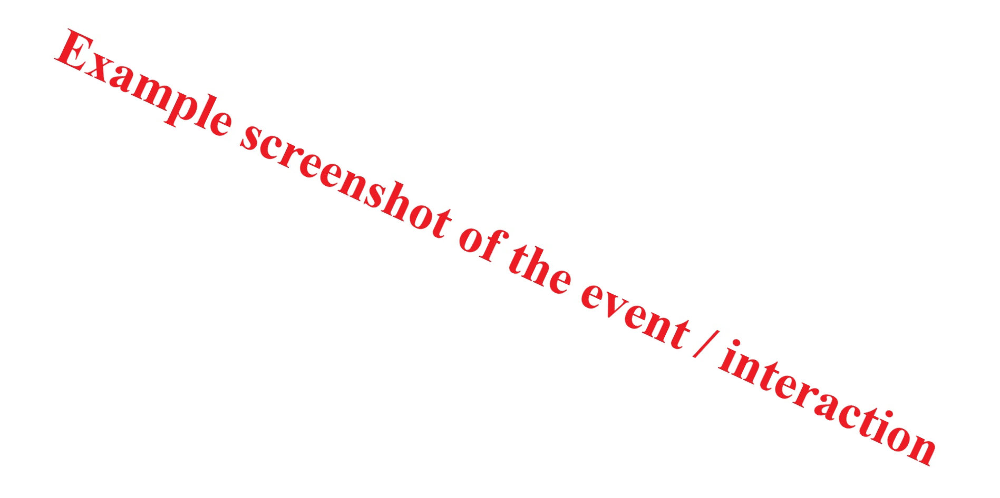

# **Case:**

Short description of the reason help was requested from the support team and the general overview of the case.

## **Start date of process:** 

* YYYY.MM.DD

## **Date of latest update to this document:** 

* YYYY.MM.DD

## **Duration of process so far (based on Date of latest update to this document):**

* XX: Number of days / weeks / months / years passed since the start of the process up to the latest update.

## **Structure of document:**

* EVENTS are sorted by ascending order of date (i.e. latest update at the end of document).
* SCREENSHOTS of events where a reply is sent to an e-mail are sorted by a descending order of date (i.e. latest reply to an e-mail is at the beginning of the screenshot).
* E-mail MESSAGES are followed by the attachments sent with the e-mail (if there’s any).

## **Number of interactions in connection with this case:**

* XX: Total number of interactions with the support team up to the date of the latest update.

## **Current status:**

* Solved / unsolved / abandoned / closed automatically / etc.

## **Previous statuses:**

* Unsolved / pending / etc. due to...

# Events #

## **Event number:** 01\.

**Event date:** YYYY.MM.DD

**Event:** Short factual description of the event.

**Issue:** What are the issues / complications related to this event?

**Step taken by customer:** Actions triggered by the event. 
